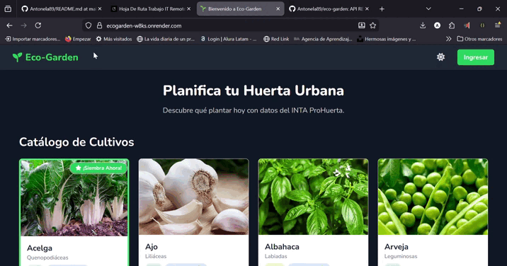
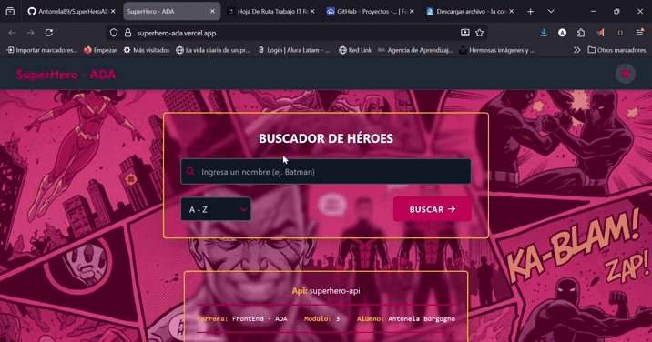
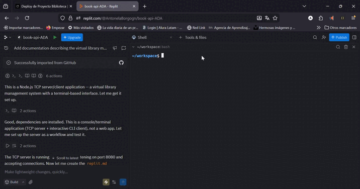
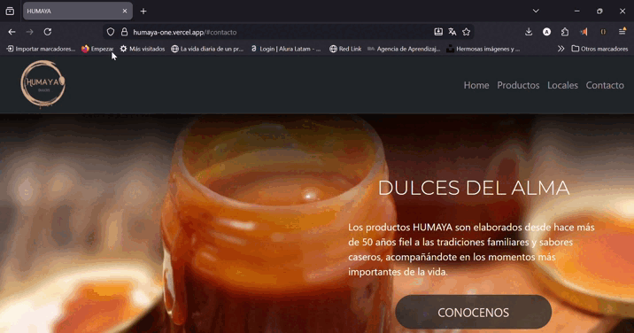
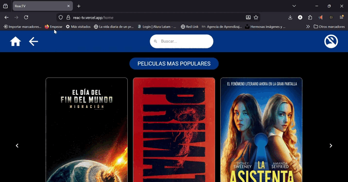
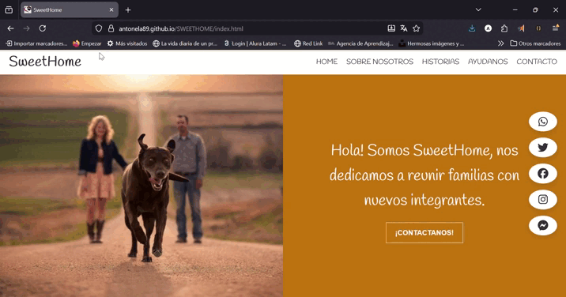

# ¡Hola! Soy Antonela Borgogno 👋

### Full Stack Developer | TypeScript & MERN Stack | Ada ITW

Soy una desarrolladora enfocada en crear software escalable y bien documentado. Mi enfoque combina una sólida base técnica en el ecosistema **JavaScript/TypeScript** con una capacidad excepcional para la organización y la gestión del tiempo.

🔭 **Actualmente:** Migrando arquitecturas complejas a **Next.js** y **Monorepos**.

---

### 💡 Sobre mí

Graduada de **Ada ITW**. Mi trayectoria personal me ha entrenado para ser altamente **adaptable y organizada**. Estoy acostumbrada a gestionar prioridades en entornos dinámicos, lo que traslado al desarrollo de software mediante:

- Cumplimiento estricto de **Sprints**.
- Comunicación clara y asertiva.
- Resolución autónoma de problemas.

Estoy buscando mi próxima oportunidad **Remota** como Desarrolladora Full Stack.

---

### 🛠 Tech Stack

**Core:**

**Frontend:**

**Backend & DB:**

**Herramientas & Metodologías:**

---

### 📊 Mis Estadísticas en GitHub

  

### 📊 Actividad en Código

  

<h3 align="left">🚀 Mis Proyectos Destacados</h3>

<table width="100%">
  <tr>
     <!-- Gestion-Escolar -->
    <td width="50%" valign="top">
      <h3 align="center">Gestion-Escolar</h3>
      

        
      

      

        <strong>Stack:</strong> Trabajando en ello.
      

      

         Gestión profesional de alumnos y panel familiar. Dashboard con reportes en tiempo real.
      

      

        
        
      

    </td>
    <!--BiblioNext -->
    <td width="50%" valign="top">
      <h3 align="center">BiblioNext</h3>
      

        
      

      

        <strong>Stack:</strong> TypeScript, Next.js, Mongo, mongoose, Tailwinds, Monorepo, FullStack.
      

      

         Gestión profesional de libros, socios y préstamos. Dashboard con reportes en tiempo real y UI optimizada con modo oscuro nativo.
      

      

        
        
      

    </td>
  </tr>
  <tr>
    <!-- Eco-garden -->
    <td width="50%" valign="top">
      <h3 align="center">Eco-Garden</h3>
      

        
      

      

        <strong>Stack:</strong> TypeScript, Express, Node.js, Mongo, HTML, CSS, Tailwinds, Javascript, Monorepo.
      

      

         API RESTful y Frontend para Eco-Garden, una aplicación de gestión de huertas urbanas. 
      

      

        
        
      

    </td>
    <!-- SuperHero -->
    <td width="50%" valign="top">
      <h3 align="center">SuperHero-ADA</h3>
      

        
      

      

        <strong>Stack:</strong> JavaScript, HTML, CSS.
      

      

        Aplicación con manejo de DOM y consumo de APIs.
      

      

        
        
      

    </td>
  </tr>
  <tr>
    <!-- Book-api -->
    <td width="50%" valign="top">
      <h3 align="center">BOOK-API-ADA</h3>
      

        
      

      

        <strong>Stack:</strong> Node.js, TCP Server, CLI.
      

      

         Servidor TCP para gestión de biblioteca con cliente de terminal interactivo para interacción fluida con la API.
      

      

        
        
      

    </td>
    <!-- Humaya -->
    <td width="50%" valign="top">
      <h3 align="center">Humaya</h3>
      

        
      

      

        <strong>Stack:</strong> JavaScript, HTML, CSS, Bootstrap.
      

      

        Maquetado moderno con Bootstrap y JavaScript ES6 para marca de dulces tradicionales.
      

      

        
        
      

    </td>
  </tr>
  <tr>
    <!-- React TV -->
    <td width="50%" valign="top">
      <h3 align="center">React TV</h3>
      

        
      

      

        <strong>Stack:</strong> React, Material UI, Firebase, API-TMDB.
      

      

        Plataforma de streaming con autenticación Firebase y consumo de API TMDB.
      

      

        
        
      

    </td>
    <!-- Seewhome -->
    <td width="50%" valign="top">
      <h3 align="center">SWEETHOME</h3>
      

        
      

      

        <strong>Stack:</strong> JavaScript, HTML, CSS.
      

      

        Página landing interactiva para adopción de mascotas.
      

      

        
        
      

    </td>
  </tr>
</table>

### ⚡ ¿Por qué trabajar conmigo?

Más allá del código, aporto valor a través de buenas prácticas:

1.  **Documentación:** Creo firmemente que un código no documentado es deuda técnica.
2.  **Testing:** Experiencia testeando endpoints y flujos de usuario.
3.  **Adaptabilidad:** Me integro rápidamente a equipos ágiles y entornos cambiantes.

---

📫 **¡Conectemos!**

